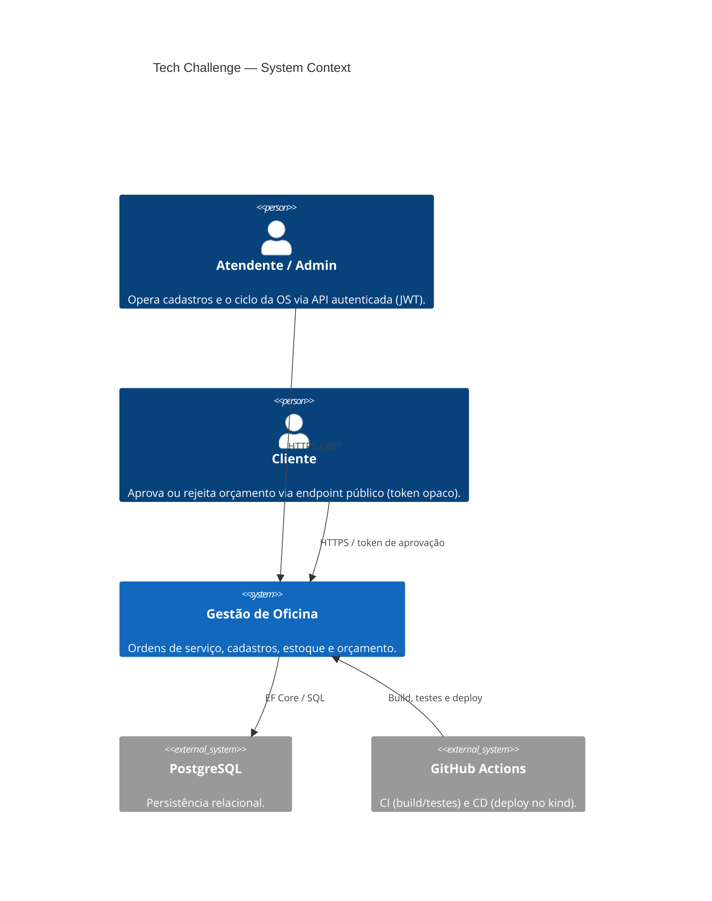
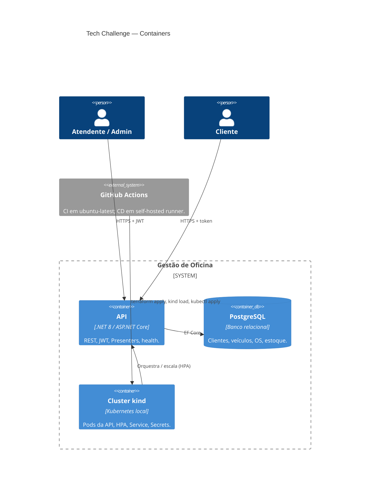
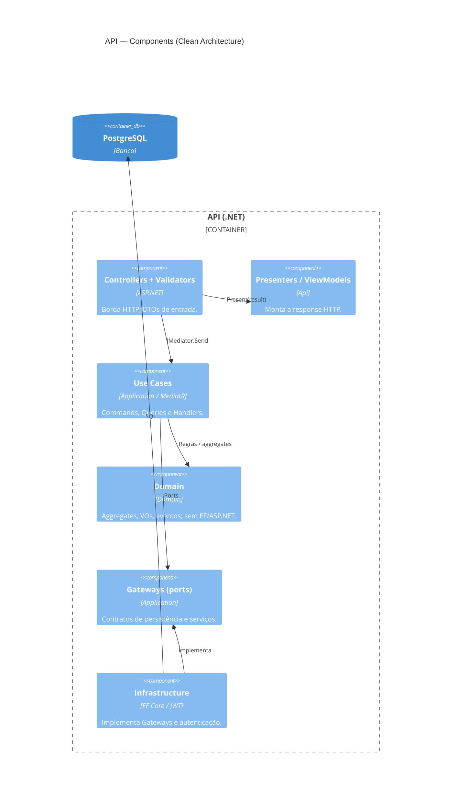
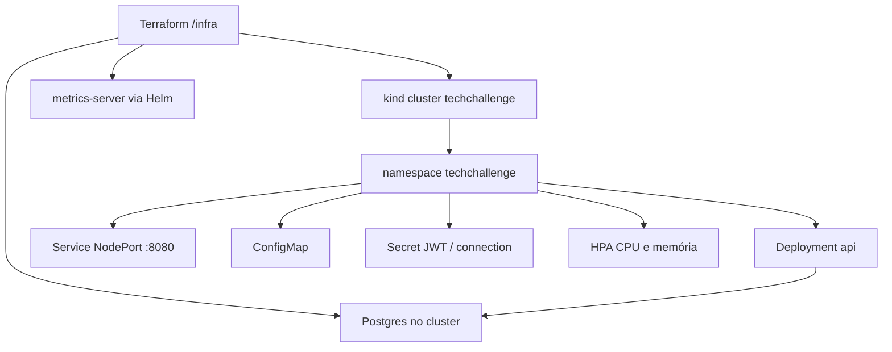
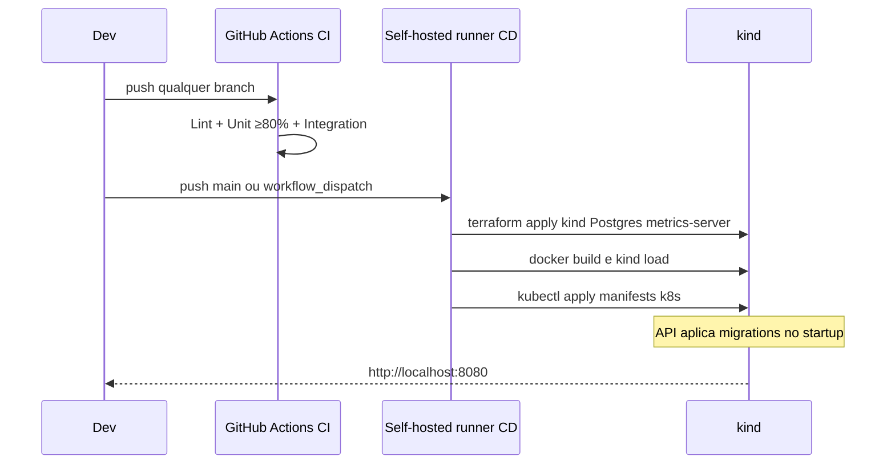

# Tech Challenge — Gestão de Oficina Mecânica (Fase 02)

Aplicação .NET 8 para gestão de ordens de serviço, clientes, veículos, serviços e estoque. Esta fase evolui a solução da Fase 1 para **qualidade**, **resiliência** e **escalabilidade**, com Clean Architecture, testes automatizados, containerização, Kubernetes (kind), Terraform e CI/CD.

## Problema e objetivos

Após a implantação do sistema inicial, a oficina ganhou eficiência, mas o aumento de demanda e a necessidade de alta disponibilidade pedem evolução. Objetivos desta fase:

- Reduzir riscos operacionais com infraestrutura escalável
- Automatizar o provisionamento e o deploy do ambiente
- Melhorar qualidade e organização do código (Clean Code + Clean Architecture)
- Suportar picos de ordens de serviço com escalabilidade dinâmica (HPA)

## Tecnologias

- .NET 8, PostgreSQL, Entity Framework Core
- Docker / Docker Compose
- Kubernetes (**kind**), Terraform, Helm (metrics-server)
- GitHub Actions (CI + CD com self-hosted runner)
- Swagger + Requestly (collections HTTP)

---

## Arquitetura proposta

### Componentes da aplicação (C4)

#### Level 1 — System Context



#### Level 2 — Containers



#### Level 3 — Components (container API)



Fluxo típico de request: `Controller` → `Use Case` → `Gateway` / `Domain` → `Presenter` → HTTP.

### Infraestrutura provisionada



Detalhes: [`docs/05_infraestrutura-kind-terraform.md`](docs/05_infraestrutura-kind-terraform.md) e [`docs/06_kubernetes-api.md`](docs/06_kubernetes-api.md).

### Fluxo de deploy



Workflows: [`.github/workflows/ci.yml`](.github/workflows/ci.yml), [`.github/workflows/cd.yml`](.github/workflows/cd.yml).

---

## APIs da Fase 02 (resumo)

| Capacidade | Endpoint | Auth |
|------------|----------|------|
| Abertura de OS (veículo + serviços + peças) | `POST /api/OrdemServico` | JWT Admin |
| Consulta de status | `GET /api/OrdemServico/{id}` | JWT Admin |
| Listagem (ordem evolutiva; exclui Finalizada, Entregue, Descartada) | `GET /api/OrdemServico` | JWT Admin |
| Aprovação / rejeição de orçamento (ator externo) | `POST /api/public/ordens-servico/aprovar?token=` · `.../rejeitar?token=` | Público (token opaco) |

O endpoint público chama os **mesmos** use cases de aprovar/rejeitar autenticados (sem SMTP). Cliente da OS vem do vínculo do veículo. Listas de serviços/peças na criação podem ser `[]`.

Decisões e deltas vs Fase 1: [`docs/04_requisitos-fase-02.md`](docs/04_requisitos-fase-02.md).

---

## Pré-requisitos

**Docker Compose (app):** Docker + Docker Compose.

**Local (`dotnet`):** .NET SDK 8+, PostgreSQL (ex.: via Compose sem profile `app`), Git.

**Kubernetes local:** `docker`, `kubectl`, `kind`, `terraform`, `helm` no `PATH`.

---

## Execução local

### Docker Compose (recomendado para demo rápida)

A imagem da API roda como usuário não-root (`app`). Connection string e JWT vêm de variáveis **obrigatórias** (sem defaults sensíveis no Compose).

```bash
cp .env.example .env
docker compose --profile app up -d --build
```

Sobe PostgreSQL (`5432`), SonarQube (`9001`), PgAdmin (`5050`) e a API (`8080`).

- API: http://localhost:8080  
- Swagger: http://localhost:8080/swagger/index.html  
- Health: http://localhost:8080/health  

Credenciais auxiliares e variáveis: [`.env.example`](.env.example). Login seed da API: `admin` / `admin`.

### SDK .NET + Postgres

```bash
docker compose up -d
dotnet restore
dotnet ef database update --project src/Infrastructure --startup-project src/Api
dotnet run --project src/Api --launch-profile http
```

API local: http://localhost:5225 — Swagger: http://localhost:5225/swagger/index.html

---

## Provisionamento com Terraform e deploy no Kubernetes

Atalho (infra + API no kind):

```bash
./scripts/up.sh          # terraform apply + load imagem + apply k8s
./scripts/restart.sh     # rebuild/reload da API
./scripts/down.sh        # derruba o cluster
```

- Terraform (`/infra`): kind + Postgres + metrics-server — guia em [`docs/05`](docs/05_infraestrutura-kind-terraform.md).
- Manifests (`/k8s`): Deployment, Service, ConfigMap, Secret, HPA — guia em [`docs/06`](docs/06_kubernetes-api.md).
- Stress do HPA: `./scripts/stress-hpa.sh` (com `watch kubectl get hpa,pods -n techchallenge`).

CD automatizado: workflow **CD** no Actions (self-hosted na mesma máquina do kind). Setup do runner e secrets: [`docs/05`](docs/05_infraestrutura-kind-terraform.md).

---

## Testes

Documentação completa: [`docs/tests/README.md`](docs/tests/README.md).

| Camada | Projeto / artefato | Comando |
|--------|--------------------|---------|
| Unitários | `tests/UnitTests` | `dotnet test tests/UnitTests/UnitTests.csproj` |
| Integração | `tests/IntegrationTests` (Docker/Testcontainers) | `dotnet test tests/IntegrationTests/IntegrationTests.csproj` |
| Cobertura | script + gate CI ≥ 80% line/branch | `./run-tests-with-coverage.sh` |
| E2E HTTP | Requestly (`docs/api`) | Importar collections — ver abaixo |

---

## CI/CD

**CI** ([`ci.yml`](.github/workflows/ci.yml)) — a cada `push` em qualquer branch, em paralelo:

- Lint (InspectCode)
- Unit tests com cobertura ≥ 80% line/branch por assembly + artifact `coverage-report`
- Integration tests (Testcontainers)

**CD** ([`cd.yml`](.github/workflows/cd.yml)) — `push` em `main` ou `workflow_dispatch`, self-hosted:

- `terraform apply` → build imagem → `kind load` → `kubectl apply`
- Migrations via `Database.Migrate()` no startup da API
- Secrets alinhados a [`.env.example`](.env.example)

---

## Collection das APIs

- **Swagger (Docker / kind):** http://localhost:8080/swagger/index.html  
- **Swagger (local SDK):** http://localhost:5225/swagger/index.html  
- **Requestly:** guia e arquivos em [`docs/api/README.md`](docs/api/README.md)
  - Exploratória: [`docs/api/requestly/tech-challenge.requestly.json`](docs/api/requestly/tech-challenge.requestly.json)
  - Suites e2e (Collection Runner): [`docs/api/requestly/tech-challenge-e2e-tests.requestly.json`](docs/api/requestly/tech-challenge-e2e-tests.requestly.json)

---

## Vídeo demonstrativo

> **TODO:** publicar no YouTube ou Vimeo (público ou não listado) e colar a URL aqui.

O vídeo (≤ 15 minutos) deve demonstrar:

1. Deploy da aplicação  
2. Execução do CI/CD  
3. Consumo das APIs  
4. Escalabilidade automática (HPA / carga)

---

## Entrega no portal do aluno

PDF com:

1. Link do repositório GitHub compartilhado com o usuário [`soat-architecture`](https://github.com/soat-architecture)
2. Desenho da arquitetura (diagramas deste README)
3. Link do vídeo (≤ 15 min)

Repositório: https://github.com/victorS7P/tech-challenge-1

---

## Estrutura do repositório

```
├── src/Api|Application|Domain|Infrastructure
├── tests/UnitTests|IntegrationTests
├── infra/                 # Terraform (kind + Postgres + metrics-server)
├── k8s/                   # Manifests da API
├── scripts/               # up / restart / down / stress-hpa
├── .github/workflows/     # ci.yml + cd.yml
├── docs/                  # Índice em docs/README.md
├── docker-compose.yml
├── Dockerfile
└── .env.example
```

## Documentação

Índice completo: [`docs/README.md`](docs/README.md)

- [Linguagem onipresente](docs/00_linguagem-onipresente.md)
- [Requisitos Fase 1](docs/01_requisitos.md)
- [Requisitos e decisões Fase 2](docs/04_requisitos-fase-02.md)
- [Infraestrutura kind + Terraform](docs/05_infraestrutura-kind-terraform.md)
- [Kubernetes — API](docs/06_kubernetes-api.md)
- [Testes](docs/tests/README.md)
- [API / collections](docs/api/README.md)
- [ADR — banco de dados](docs/adrs/001-escolha-banco-de-dados.md)
- [Guia para agentes de IA](AGENTS.md)
