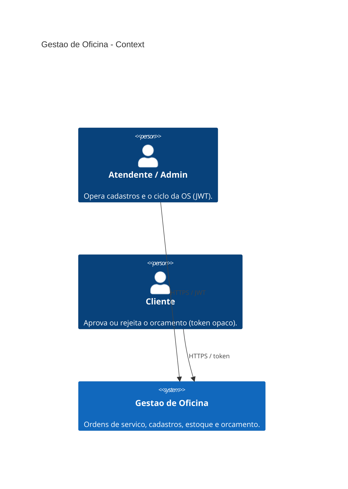
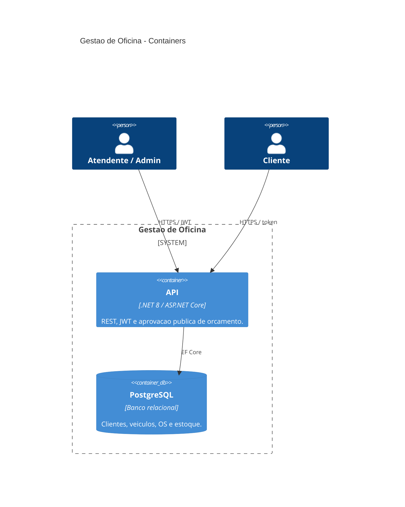
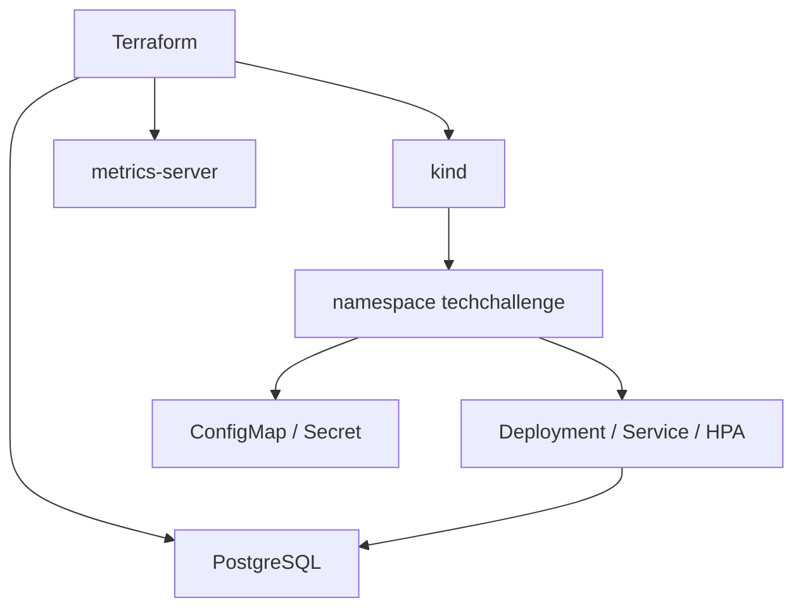
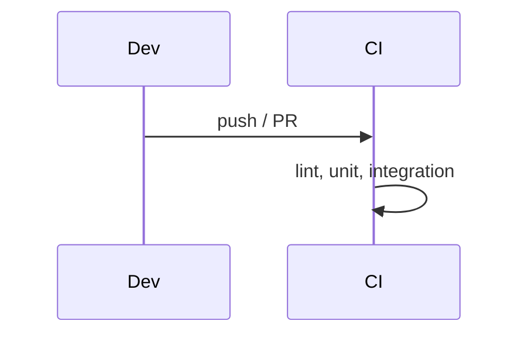

# Gestão de Oficina Mecânica

API .NET 8 para ordens de serviço, clientes, veículos, catálogo de serviços e estoque. Clean Architecture, PostgreSQL, Docker Compose (dev local). Entrega Fase 03 na GCP fica em `infra-db` / `infra-k8s` (kind local é legado).

## Arquitetura

### C4 — System Context



### C4 — Containers



Fluxo interno da API: `Controller` → `Use Case` → `Gateway` / `Domain` → `Presenter` → HTTP.

### Infraestrutura



### CI



Kind + Terraform em [`docs/04`](docs/04_infraestrutura-kind-terraform.md) / [`docs/05`](docs/05_kubernetes-api.md) são **legado local** (não é CD de entrega Fase 03). Deploy GCP: repos `infra-*` + workflow manual na §5.

---

## Como executar

### Docker Compose

```bash
cp .env.example .env
docker compose --profile app up -d --build
```

- API / Swagger / Health: http://localhost:8080 · `/swagger` · `/health`
- Login seed: `admin` / `admin`
- Variáveis: [`.env.example`](.env.example)

### SDK .NET

```bash
docker compose up -d
dotnet restore
dotnet ef database update --project src/Infrastructure --startup-project src/Api
dotnet run --project src/Api --launch-profile http
```

API local: http://localhost:5225

### Kubernetes (kind) + Terraform

```bash
./scripts/up.sh
./scripts/restart.sh
./scripts/down.sh
```

HPA: `./scripts/stress-hpa.sh` · `kubectl get hpa,pods -n techchallenge`

---

## APIs principais

| Capacidade | Endpoint | Auth |
|------------|----------|------|
| Abrir OS (veículo + serviços + peças) | `POST /api/ordens-servico` | JWT Admin |
| Consultar OS | `GET /api/ordens-servico/{id}` | JWT Admin |
| Listar OS ativas | `GET /api/ordens-servico` | JWT Admin |
| Aprovar / rejeitar orçamento | `POST /api/public/ordens-servico/aprovar?token=` · `.../rejeitar?token=` | Público |

Listagem exclui Finalizada, Entregue e Descartada; ordenação por status evolutivo e data. Aprovação pública reutiliza os mesmos use cases da API autenticada. Requisitos: [`docs/01_requisitos.md`](docs/01_requisitos.md).

---

## Testes e CI/CD

```bash
dotnet test tests/UnitTests/UnitTests.csproj
dotnet test tests/IntegrationTests/IntegrationTests.csproj   # requer Docker
./run-tests-with-coverage.sh                                 # meta ≥ 80%
```

- Estratégia: [`docs/06_testes.md`](docs/06_testes.md)
- Collections HTTP: [`docs/07_api.md`](docs/07_api.md) (Swagger + Requestly)
- CI: lint + unit + integration em paralelo ([`ci.yml`](.github/workflows/ci.yml))
- CD kind/self-hosted: **removido** (Fase 03). Deploy GCP manual na §5.

---

## Documentação

Índice: [`docs/README.md`](docs/README.md)
