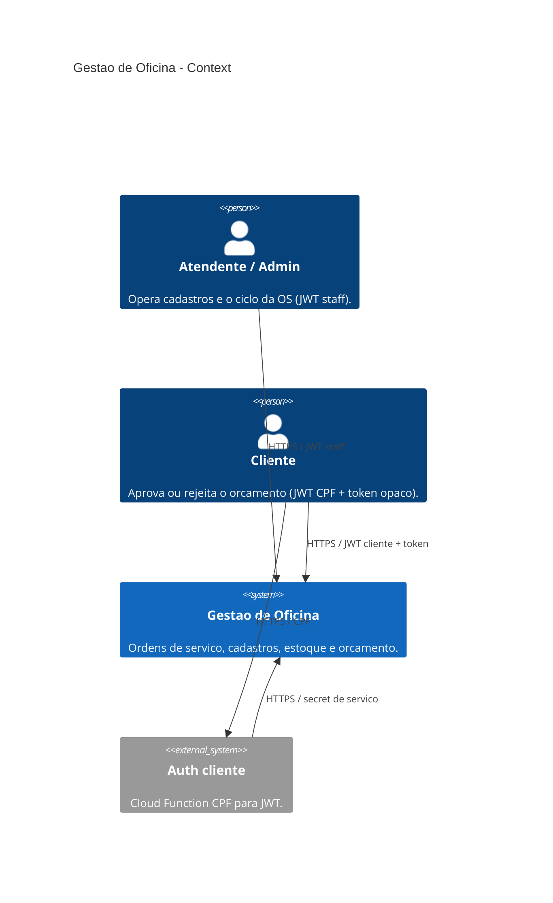
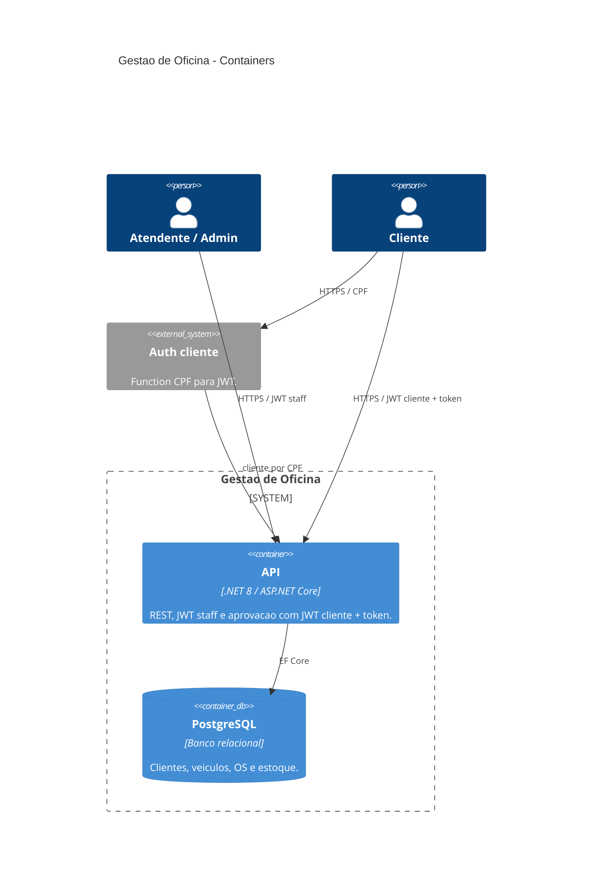
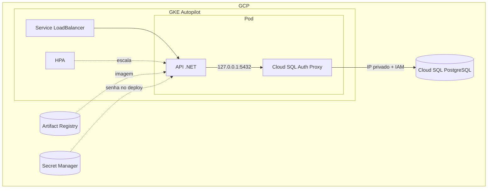
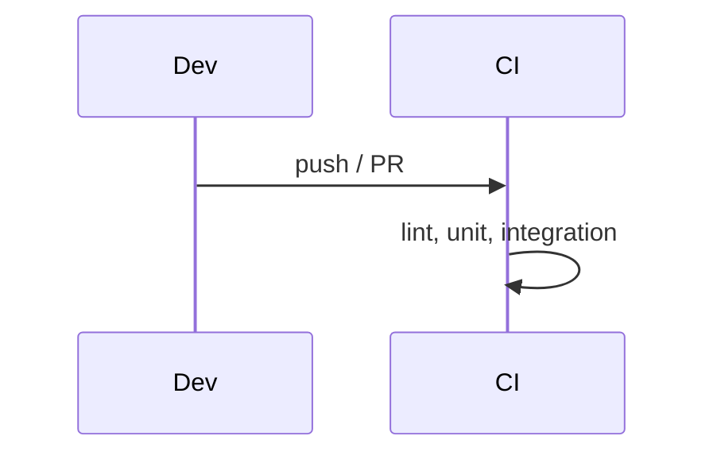

# Gestão de Oficina Mecânica

API .NET 8 para ordens de serviço, clientes, veículos, catálogo de serviços e estoque. Clean Architecture, PostgreSQL, Docker Compose para dev local e GKE Autopilot na GCP. Cluster e banco são provisionados pelos repos [`infra-k8s`](https://github.com/fiap-vcosta/infra-k8s) e [`infra-db`](https://github.com/fiap-vcosta/infra-db); os manifests e o deploy moram aqui.

## Arquitetura

### C4 — System Context



### C4 — Containers



Fluxo interno da API: `Controller` → `Use Case` → `Gateway` / `Domain` → `Presenter` → HTTP.

### Infraestrutura



### CI



---

## Como executar

### Docker Compose

```bash
cp .env.example .env
docker compose --profile app up -d --build
```

- API / Swagger / Health: http://localhost:8080 · `/swagger` · `/health`
- Login seed: `admin` / `admin`
- Variáveis: [`.env.example`](.env.example)

### SDK .NET

```bash
docker compose up -d
dotnet restore
dotnet ef database update --project src/Infrastructure --startup-project src/Api
dotnet run --project src/Api --launch-profile http
```

API local: http://localhost:5225

---

## Deploy na GCP

Manifests em [`k8s/`](k8s/): namespace, service account, ConfigMap, Deployment, Service `LoadBalancer` e HPA. O Deployment roda o **Cloud SQL Auth Proxy como sidecar nativo**, que autentica na instância por IAM (Workload Identity) e escuta em `127.0.0.1:5432` — a API só conhece `localhost`.

Não há Job de migration: a aplicação roda `db.Database.Migrate()` no start, e o sidecar nativo garante que o túnel esteja pronto antes disso.

| Workflow | Quando | O que faz |
|----------|--------|-----------|
| [`build-push`](.github/workflows/build-push.yml) | Merge em `main` | Build da imagem e push no Artifact Registry (`:latest` + SHA curto) |
| [`deploy`](.github/workflows/deploy.yml) | Só manual | Aplica os manifests com a imagem `:latest` e devolve o IP público |

O `build-push` mantém o registry sempre com a imagem da `main`, e é independente de cluster e banco — roda fora da janela de demo. O `deploy` sempre usa `:latest`.

A cada deploy o workflow:
- lê a senha do banco no Secret Manager;
- **gera** uma chave JWT de **funcionário** nova (`JwtFuncionario__Key`);
- injeta `JwtCliente__Key` e `ServiceAuth__Key` a partir de **GitHub Secrets do repo** (valores **estáveis** — a Function `auth` precisa do mesmo material).

Nada disso vai para o Git ou tfstate. Em troca, o JWT de staff rotaciona a cada redeploy (basta logar de novo); o JWT cliente e o secret de serviço **não** mudam entre deploys.

Pré-requisitos: cluster no ar (`infra-k8s` → `tf-apply`), banco no ar (`infra-db` → `tf-apply`), as org vars `GCP_PROJECT_ID`, `GCP_REGION`, `GCP_AR_REPOSITORY`, `GCP_GKE_CLUSTER_NAME`, `GCP_DB_PASSWORD_SECRET`, `GCP_WORKLOAD_IDENTITY_PROVIDER` e `GCP_SERVICE_ACCOUNT_EMAIL`, e os **repo secrets** abaixo (criar uma vez em Settings → Secrets do `fiap-vcosta/api`):

| Secret | Uso |
|--------|-----|
| `JWT_CLIENTE_KEY` | Assinatura/validação do JWT cliente (mesma chave que a Function usará na §8) |
| `SERVICE_AUTH_KEY` | Header `X-Service-Key` no endpoint `GET /api/system/clientes/por-documento/{documento}` |

Gerar valores (exemplo):

```bash
openssl rand -base64 48   # JWT_CLIENTE_KEY
openssl rand -base64 32   # SERVICE_AUTH_KEY
```

Issuer/Audience do JWT cliente ficam no ConfigMap (`tech-challenge-cliente`), alinhados ao Compose local.

Evidência de HPA depois do deploy:

```bash
./scripts/stress-hpa.sh http://<ip-do-loadbalancer>
kubectl get hpa,pods -n tech-challenge
```

---

## APIs principais

| Capacidade | Endpoint | Auth |
|------------|----------|------|
| Abrir OS (veículo + serviços + peças) | `POST /api/ordens-servico` | JWT Admin |
| Consultar OS | `GET /api/ordens-servico/{id}` | JWT Admin |
| Listar OS ativas | `GET /api/ordens-servico` | JWT Admin |
| Aprovar / rejeitar orçamento | `POST …/ordens-servico/aprovar?token=` · `…/rejeitar?token=` | JWT **cliente** + token opaco |
| Cliente por CPF (serviço) | `GET /api/system/clientes/por-documento/{documento}` | `X-Service-Key` |

Listagem exclui Finalizada, Entregue e Descartada; ordenação por status evolutivo e data. Aprovação reutiliza os mesmos use cases da API autenticada; o CPF do JWT deve ser o do dono da OS. Requisitos: [`docs/01_requisitos.md`](docs/01_requisitos.md). Auth cliente: repo [`auth`](https://github.com/fiap-vcosta/auth).

---

## Testes e CI/CD

```bash
dotnet test tests/UnitTests/UnitTests.csproj
dotnet test tests/IntegrationTests/IntegrationTests.csproj   # requer Docker
./run-tests-with-coverage.sh                                 # meta ≥ 80%
```

- Estratégia: [`docs/06_testes.md`](docs/06_testes.md)
- Collections HTTP: [`docs/07_api.md`](docs/07_api.md) (Swagger + Requestly)
- CI: lint + unit + integration em paralelo ([`ci.yml`](.github/workflows/ci.yml))
- CD: `build-push` em merge na `main`, `deploy` manual (ver [Deploy na GCP](#deploy-na-gcp))

---

## Documentação

Índice: [`docs/README.md`](docs/README.md)
