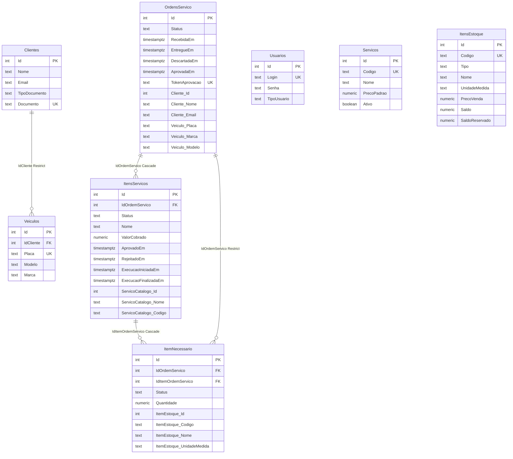

# Modelo de dados

Esquema PostgreSQL da API (EF Core / Npgsql). Justificativa do banco relacional: [ADR 001 em `infra-db`](https://github.com/fiap-vcosta/infra-db/blob/main/docs/adrs/001-escolha-banco-de-dados.md). Instância Cloud SQL: [ADR 002 em `infra-db`](https://github.com/fiap-vcosta/infra-db/blob/main/docs/adrs/002-cloud-sql.md).

Fonte de verdade do mapeamento: [`AppDbContext`](../src/Infrastructure/Database/AppDbContext.cs) e o snapshot de migrations.

## Diagrama ER

## Relacionamentos (FK)

| De | Coluna | Para | Delete |
|----|--------|------|--------|
| `Veiculos` | `IdCliente` | `Clientes` | Restrict |
| `ItensServicos` | `IdOrdemServico` | `OrdensServico` | Cascade |
| `ItemNecessario` | `IdItemOrdemServico` | `ItensServicos` | Cascade |
| `ItemNecessario` | `IdOrdemServico` | `OrdensServico` | Restrict |

Catálogo (`Servicos`, `ItensEstoque`) e cadastro (`Clientes`, `Veiculos`) **não** têm FK a partir da OS: a ordem guarda um **snapshot** (ver abaixo).

## Snapshots (`ComplexProperty`)

Na abertura/diagnóstico da OS, o domínio copia dados do cliente, veículo, serviço de catálogo e item de estoque para value objects persistidos como colunas `Cliente_*`, `Veiculo_*`, `ServicoCatalogo_*` e `ItemEstoque_*`. Não são foreign keys: a OS permanece legível mesmo se o cadastro mudar depois (preço, nome, e-mail).

## Enums (persistidos como `text`)

| Enum | Valores |
|------|---------|
| `TipoUsuario` | `Admin`, `Atendente`, `Mecanico`, `Cliente` |
| `TipoDocumento` | `Cpf`, `Cnpj` |
| `ItemTipo` | `Peca`, `Insumo` |
| `UnidadeMedida` | `Unidade`, `Jogo`, `Par`, `Litro`, `Kg`, `mL`, `Frasco` |
| `StatusOrdemServico` | `Recebida`, `EmDiagnostico`, `AguardandoAprovacao`, `ChecandoEstoque`, `AguardandoPeca`, `LiberadaParaExecucao`, `EmExecucao`, `Finalizada`, `Descartada`, `Entregue` |
| `StatusItemOrdemServico` | `Sugerido`, `Aprovado`, `Rejeitado`, `Concluido` |
| `StatusItemEstoque` | `EstoqueNaoChecado`, `EstoqueEmFalta`, `EstoqueDisponivel`, `EstoqueTravado`, `Utilizado` |

## Precisão numérica

| Tabela | Coluna | Precision |
|--------|--------|-----------|
| `Servicos` | `PrecoPadrao` | `(10,2)` |
| `ItensEstoque` | `PrecoVenda` | `(10,2)` |
| `ItensEstoque` | `Saldo`, `SaldoReservado` | `(10,3)` |
| `ItensServicos` | `ValorCobrado` | `(10,2)` |
| `ItemNecessario` | `Quantidade` | `(10,3)` |

## Naming

- Catálogo de serviços: tabela `Servicos` (`ServicoAggregateRoot`).
- Linha de serviço na OS: tabela `ItensServicos` (entidade de domínio `Servico` sob `OrdemServico`) — sem FK para o catálogo, só snapshot `ServicoCatalogo_*`.
